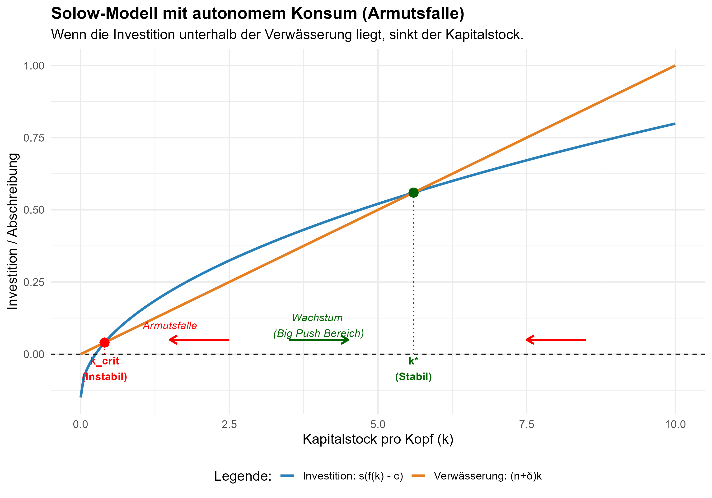

# Neoklassische Wachstumstheorie -- exogene Sparquote

::: {.callout-note icon="false"}
## Kernbotschaften

-   Kapital kann durch Investitionen akkumuliert werden

-   Der wachsende Kapitalstock führt zu höherer Produktion.

-   Der Kapitalstock kann aber nicht aus sich heraus über ein bestimmtes Niveau hinaus wachsen.

-   Das langfristige Wachstum des Einkommens pro Kopf wird durch *technischen Fortschritt* erklärt.

-   Der Fortschritt ist im Modell *exogen*.
:::

::: {.callout-tip icon="false" collapse="true"}
# Der Podcast zur Vorlesung {.unnumbered}

```{=html}
<script class="podigee-podcast-player" src="https://player.podigee-cdn.net/podcast-player/javascripts/podigee-podcast-player.js" data-configuration="https://wirtschaftskunde.podigee.io/62-makro-am-mikro-19-das-solow-modell-teil-1/embed?context=external"></script>
```
:::

## Produktionsfunktion

Allgemeine Form Cobb-Douglas Produktionsfunktion

$Y=A{K}^{\alpha }{L}^{\beta }$

Annahme: Konstante Skalenerträge

$Y=A{K}^{\alpha }{L}^{\left(1-\alpha \right)}$

Für das Folgende nehmen wir zunächst an $A=1$

## Bevölkerungsentwicklung

$L_t=L_{t-1}(1+n)$

## Kapitalbildung

Geschlossene Volkswirtschaft

$I=S$

Exogene Sparquote $s$

${I}_t=S_t=s{Y}_t$

Veränderung des Kapitalstocks

${K}_{t+1}=\left(1-\delta \right){K}_t+{I}_t$

## Pro-Kopf-Größen

Pro-Kopf-Einkommen

$y=\frac{Y}{L}=\frac{A{K}^{\alpha }{L}^{1-\alpha }}{L}=\frac{A{K}^{\alpha }L}{L^{\alpha }L}=A{\left(\frac{K}{L}\right)}^{\alpha }$

Kapitalstock pro Kopf

$\frac{K_{t+1}}{L}=\left(1-\delta \right)\left(\frac{{K}_{t}}{\mathrm{L}}\right)+\mathrm{s}\left(\frac{{Y}_{t}}{\mathrm{L}}\right)$

oder kürzer

${k}_{t+1}=\left(1-\delta \right){k}_t+s{y}_t$

Pro-Kopf-Konsum

$c=\left(\frac{C}{L}\right)=\left(1-s\right)\left(\frac{Y}{L}\right)$

## Langfristiges Gleichgewicht

Die Produktion $Y$ wächst, wenn

-   $A$ wächst (Technischer Fortschritt)

-   $L$ wächst (Bevölkerungswachstum)

-   $K$ wächst (Kapitalakkumulation)

Fokus hier: Wachstum von $K$

::: {.callout-note icon="false"}
## Pfad zum Gleichgewicht

Investitionen lassen den Kapitalstock wachsen. Abschreibungen (Verschleiß) lassen ihn schrumpfen.

**Gleichgewicht:** Investitionen = Abschreibungen
:::

$s{\left(\frac{\mathrm{K}}{\mathrm{L}}\right)}^{\alpha }=\delta \left(\frac{K}{L}\right)$

$\iff s=\delta {\left(\frac{\mathrm{K}}{\mathrm{L}}\right)}^{1-\alpha }$

$\iff \frac{s}{\delta }={\left(\frac{\mathrm{K}}{\mathrm{L}}\right)}^{1-\alpha }$

$\iff k=\left(\frac{K}{L}\right)={\left(\frac{s}{\delta}\right)}^{\frac{1}{1-\alpha }}$

$\iff y=\left(\frac{\mathrm{Y}}{\mathrm{L}}\right)={\left(\frac{s}{\delta}\right)}^{\frac{\alpha }{1-\alpha }}$

$\rightarrow$ Es gibt einen langfristigen Kapitalstock, der nicht mehr aus sich heraus wächst.

$\rightarrow$ Damit gibt es auch ein langfristig gleichgewichtiges Einkommen und ein Lälangfristig gleichgewichtiges Konsumniveau

$\rightarrow$ Dies gilt *unabhängig* von dem Ausgangswert des Kapitalstocks

## Entwicklung des Kapitalstocks

```{python}
#|message: false
#|warning: false


import plotnine as gg
import numpy as np
import pandas as pd

# Parameter
alpha = 0.4
delta = 0.1
s = 0.2
L = 1 # einfachster Fall
n = 0 # Bevölkerungswachstum

# Zeitschritte
t = np.linspace(0, 100, 101)

# Kapitalakkumulation
##Vorbeteitung

K_t = np.zeros(len(t))
Y_t = np.zeros(len(t))
I_t = np.zeros(len(t))
L_t = np.zeros(len(t))
k_t = np.zeros(len(t))
y_t = np.zeros(len(t))

## Ausgangswerte

K_t[0] = 2
Y_t[0] = (K_t[0]**alpha)*(L**(1-alpha)) #CD-Funktion
I_t[0] = s*Y_t[0]
L_t[0] = L
y_t[0] = Y_t[0]/L_t[0]
k_t[0] = K_t[0]/L_t[0]

## Dynamik


for i in range(1, len(t)):

    K_t[i] = (1-delta)*K_t[i-1] + I_t[i-1]
    Y_t[i] = (K_t[i]**alpha) * (L**(1-alpha))
    I_t[i] = s*Y_t[i]
    L_t[i] = (1+n)*L_t[i-1]
    k_t[i] = K_t[i]/L_t[i]
    y_t[i] = Y_t[i]/L_t[i]


## In Datenframe speichern
df = pd.DataFrame({'t': t, 'Kapital': K_t, 'Y': Y_t,
                    'Investitionen': I_t, 'Abschreibungen': delta*K_t,
                    'Bevölkerung': L_t, 'Kapital pro Kopf': k_t,
                  'y': y_t})
      
```

```{python}
#|message: false
#|warning: false

#Grafiken


(gg.ggplot(df, gg.aes('t', 'Kapital pro Kopf')) + gg.geom_line() +
 gg.labs(x='Zeit', y='Kapital pro Kopf',
 title= "Kapital pro Kopf im Zeitverlauf")+
 gg.theme_light()
)
```

```{python}
#|message: false
#|warning: false


(
    gg.ggplot(df, gg.aes('t')) 
    + gg.geom_line(gg.aes(y='Investitionen', color='"Investitionen"')) 
    + gg.geom_line(gg.aes(y='Abschreibungen', color='"Abschreibungen"')) 
    + gg.scale_color_manual(
        values=["blue", "red"],  # Farben explizit zuweisen
        name="Kurven"        # Legendentitel
    )
    + gg.labs(
        x='Zeit', 
        y='Investitionen, Abschreibungen',
        title="Investitionen und Abschreibungen im Zeitverlauf"
    )
    + gg.theme_light()
    + gg.theme(legend_position="right")  # Legendenposition anpassen
)


```

```{python}
#|message: false
#|warning: false

(
    gg.ggplot(df, gg.aes('Kapital pro Kopf')) 
    + gg.geom_line(gg.aes(y='Abschreibungen', color='"Abschreibungen"'))  # Rot für Abschreibungen
    + gg.geom_line(gg.aes(y='Investitionen', color='"Investitionen"'))   # Blau für Investitionen
    + gg.scale_color_manual(
        values=["blue", "red"],  # Neue Reihenfolge: Investitionen blau, Abschreibungen rot
        name="Kurven",
        breaks=["Investitionen", "Abschreibungen"]  # Explizite Reihenfolge der Legende
    )
    + gg.labs(
        x='Kapital pro Kopf', 
        y='Investitionen, Abschreibungen',
        title="Investitionen und Abschreibungen als Funktion von k"
    )
    + gg.theme_light()
    + gg.theme(
        legend_position="right",
      
    )
)


```

## Entwicklung des Einkommens

```{python}
#|message: false
#|warning: false


(gg.ggplot(df, gg.aes('t', 'y')) + gg.geom_line() +
 gg.labs(x='Zeit', y='Pro Kopf Einkommen')+
 gg.theme_light()
)

```

::: {.callout-note icon="false" collapse="true"}
# Interaktives Solow-Modell {.unnumbered}

<iframe src="https://shinylive.io/r/app/#code=NobwRAdghgtgpmAXGKAHVA6ASmANGAYwHsIAXOMpMAYgAIAxKAGyYGdaAFKAaznNoBmcABZMKiWgEsIrUsyYZUUAtygBzOKwAUBLQB0wrYdICeB3LQMATVExMAnc5bBq1toqQBMTg6UlWHAwBKIL0IJkkAI3soexMtI1NQ8KiYuK0bO3tkiOjY+Nd3LxzU-K0-AOywsLoAWnraAEYMWgBVVjh7WgBJMk6BZThaLVbuoNp62rCAV0laAB5awSZZqy4NfQhaSy3aOgAVSXImWitO2gBBdDDtv1IxLgg4Jn0wXvIY7j8AN01aAGUiEwiAB3WoAdWUwlk0xgrBgRDOLGCuBuO22dH+cCOFDEklkFFqABkoCYiNNSBIidJuOwrJIhv8Imd7BZ7HACMJSHTzhxgaQ0ax-HBIrESWSKZtttshWdRfZHs8pdLtsIACyvLgxeAfWhQCBKVgdCAotEq1jMzq9VCSgzMVDCKA+MAAaTQR3t9kR0y+khIHSYUFkkgAXkcACekYb2x1BRA+XYqpPJ2gwaS0AC8tAADBhGhYYFAAB6ZnMYACcFm+zGmQyzubVFgJqFLuezAFYgqjE9KLcL7NbbWAkXJnRdIqxOeyotMIGpWDF+BlnnI4wmUxvpWmtvWMNn86ni62MABmKs1utlg-N4-7rtm3uWgcGoesZ3-JT2ACO0w8QwSa54Oim4btut7tgWR67uWEG0NWKyXrmnhNuQLa7h2949jKT6DqQrwmkBBgAEJwN8ABvTC8PYs7ziCUIwjAwwQIBFgPiBKpgVmtRtrBhYlruB7wbWt4oXAaFlne3bJn2LK4a8LqNO+cj2KQqioB6JxaC6wCNAAuixwHsUmnFXpB-FNLBQmXshtA3gJmHJsI9haA5SbCM8qD7HARZ4QYABqnThhALJbP8DKnOF-ycgykSdHAahiKytCwrQIbTLZIgUBYILhUKnKnEGtBuupciadwXYRUMHBelYPp+CQwwmOMs5WKc5wuv6KU6OMqBekVRCoAItAAD+xV09JDAAWtiUYUKQOUqM8EAYMED6udsD50AAElA0yoKQY3YvlAjDeNFCcPyD6FtIiovGxtBFAA8hSNq+YYQKgnyHhOO5khqFypYGAA7Nm2aoEWq09sk2zJMkNQTA0ngtFi9i-PYxJEGokjcAjUwyJ0aMLEsAizgQ9UQFo0ivRY5KkK94wgGiaJ0FgcDKD8VX8rUADiFCdAy1FzmitOvQAJKwH0gl9UaLLQ7LBZ00taIzPabU0LRarAfDnLtPJbKMtRMv2Wy62IxoPjGUBE1IL6kKLlsPiOVuy1TFKi07D7sC7tviw+Wze2LJo9i6AD6sixDLSyu3bCkPg+RIh9m1uKT2+xh6hXtLI0+4PpHOaIFoafNuwWfQ9KaskeRlGdDRtCHZyTxByqRLWwnScAFTDI0tAANS0MxAB6Aqqz2dBI0V7qlbU3QfFA5MPi61sQLC-O6EXGdl9s2l6dbofhyphmHwIRBdJTNu0J4iDr2JrAM-d2mSLp1taN3SxO+MncP7UO99+wndacASQ39dID0th-YYRJAHAIHi-WoYDN60AAL5x1HrQE8yNyBQACACOQ5B2D12EI3CubNOTkFCgyCQTte79ykIxAAchQJ4SUUqVwolRGirA6KcgYqldKY1hoqDylyP6FAHzcDDpnYY7AAD0wwqF92YkEGB3dZEvwmHqJgDooAhAfCYCR1txFGlAZox0D4CD6NlmopYt9aCdz0UaFBKo6BqhaAAETnhQXaAhDpHFridLojACB8DfD2KwAgQ4DCCdya2fhIiRDEOUUspALCLyzC6CwLcsxEnGAAUgAHw5PujACkHjlTJhxmk2gsiiRSRTCYUs3BjFaNqcmAgpYrG2XAWYLCtBckFPugGDkeFkm0G4BYEwFgCB9MKT09S3wPAh2BHOToOggTsC4iM6A8BWAh1IEQQGYA-KxEkFAeJcAnBWR2Xsg54JOgCjANMopJTyBaCOfYE5ZzSyRL2c5N5HyxAWDEL8NgpZdAGG4M6MwhFCAokPkZeF2xAyxRBVmMFrpJ7MAen1Dqg1hjlWdNVb0voGpaCas6DqMgupTOCDokeTjaBbUkEwAQrBajuLkAIbUQx-E4LZgEQ2uC4DEmkAyLYLVaAkmRSElUYSLFLFiWcsp0o-mnLEF89mJ8dDyQxScXq+ycVDS0Pi6FhLarEq2KS0I0KKWsCpVaiq90EUqiBc8dZtA0XFQ0li-VA1DXGtYmAU1dU-QWrJdazqjFuo0pab2HZII7mgqNRI8Zyb3USPWtKJFzxdneSjFmQ0LyDD-Ewdg4tHj4xAS9C1LVhjWApqNJM9NFhPC0pVAgtW7YNb8lTEcQQgxSAhxBDEFsIYjqENET2Qo-IMjhMicEiwUBNBaHMiM+pWZbkqRCL3e6GgiAwEWdIOAqzgRdCzAYAkzx4m1icBEJ4OUrCkGEKWZoLbt09N3fu0Qh6MhzytlmWVDa9RLpMNID4QT9qliNIOu5FVb18BMKgS81ggzuSsE4YgJ6DkCEkOyaIkgVA3sPfex9x4AAc4we47rgHunNPkf1yFLAButQHtDmWvqgP+ZZSOwTXbZONdzAWnOeKWLNTBaOkAdT0kC3wABW0xZDPowLBDDJ8sM4ZFO8gjQFj5kDnQcyIQI0NASFKO0sLjOxvuTHOgdQ60BaAAH60BVWcpsBBmB-DPWATlcA4AhyhRYCAGHn0Ufuki7QjraB3DVZ51xJgtnY1oQCSWEJ6KkFhPCREzwmDmAi7ayIUWkNgBIkQUUpDzphSGBNfqEA0YaAgCGXhbVQolvqWWvB58ACipDR1HBy1J2g5kDDTV7eUK1MaVS8YMBuqMer+qDQMPdELPTH1wHgCHbckhCwvCW8mFb8AlXmlIO8zA5AfKlmeKtua4mtB6c8wZpgRmmyhkvI0Ft43pRFAwAV87Yh4BkGuyZl7AA2Cwt3nD3aMxmlUxZ8RfaONF2gF2-sDtO3hQHz6W2LbRIg5IyCg51AaOgy46BbLKTIbjMIiQIAmCuKgLQsxSyzCbATc4WYOio06EEMAiDdJAA" width="100%" height="800" title="Interaktives Solow-Modell">

</iframe>
:::

## Armutsfalle

-   Im Standard-Solow-Modell führt jedes positive Startkapital $k_0 > 0$ langfristig zum selben Steady State $k^*$. Die Einführung von autonomem Konsum (Subsistenzniveau) bricht diese globale Konvergenz.

-   **Kernidee**: Haushalte müssen zuerst einen Mindestbetrag $\bar{c}$ konsumieren, um zu überleben. Nur das Einkommen, das über $\bar{c}$ hinausgeht, kann anteilig gespart werden.

-   **Modifizierte Sparfunktion**: Die Ersparnis (Investition) ist nicht mehr einfach $s \cdot y$, sondern:$$\bar{s} = s(f(k) - \bar{c})$$

-   **Folge**: Bei sehr geringem Kapitalstock reicht die Produktion kaum aus, um $\bar{c}$ zu decken. Die Investitionen sind zu gering, um den Verschleiß $(n + \delta)k$ auszugleichen.

-   Die Dynamik des Kapitalstocks pro Kopf wird durch die folgende Differenzialgleichung beschrieben:$$\dot{k} = s(Ak^\alpha - \bar{c}) - (n + \delta)k$$

-   Hierbei gilt:

    -   $\dot{k} > 0$: Kapitalstock wächst (Akkumulation).

    -   $\dot{k} < 0$: Kapitalstock schrumpft (Dekumulation/Armutsfalle)

**Zusammenfassung der Bedingungen**

| Zustand | Bedingung | Resultat |
|:---|:---|:---|
| **Armutsfalle** | $k_0 < k_{crit}$ | Kapitalstock sinkt Richtung 0: $\dot{k} < 0$ |
| **Entwicklung** | $k_0 > k_{crit}$ | Konvergenz gegen reichen Steady State: $k \to k^*$ |
| **Keine Hoffnung** | $s(Ak^\alpha - \bar{c}) < (n + \delta)k$ für alle $k$ | Kein Schnittpunkt; Kollaps für jedes $k_0$ |



::: {.callout-note icon="false" collapse="true"}
# Interaktives Solow-Modell mit Armutsfalle {.unnumbered}

<iframe src="https://shinylive.io/r/app/#code=NobwRAdghgtgpmAXGKAHVA6ASmANGAYwHsIAXOMpMAGwEsAjAJykYE8AKAZwAtaJWAlAB0IdJiw4BzSampFSAJmGiGzNuwAms1o2Vi1HUrQ07lIgMQACALS3LAVQCSlgCJwAZn1pGSN2yIBXWksAHmtLd2ogjQAFKEk4dhFLSyNSajg4iDhqJLAAZSI5AHdrAFkiDRzqREsAQUYYANJOdyhqDMsAMksYxkqAgGsjADdvABPSITABXGTLTmM4ehYAGShWImakiBSUxaqVxiycnb297gAWPLjmeHJGadn58846KsZHCFRt6cGABmmuEs03ypBYpEGaG87Us7ABAkQQMs-wwAEZgWj-piMNiUejnrtzpYrAA5ACi9lq+QIvGWcEYcEkGUYEQAP6y6tRUNwoC89m8lp9vr8UNzecjpgBpaHgjLUKCcIwALwmpDhgEbgRHI1EY-EATmBqIArEbccbCcSFu8GV8fqQ8nVJWA+gNhrQxqRJnC6tq8PjTZZLricYHdZbiYKPnbRZxnflUCwAI4BeRwOGcP1m-5hjAANjNAGZsxa5kTXjbhfa8gQAPpHZ11ZokIjwVlSkicAIwOEELMo0Nm3NoiMVoUxh3TCBVajgxv0Ti0xkMAIQSTdSwAITgIww1gA6lBaUru3DdgBqSyAFuB+6j-nrUZczWjc-fRxdGOx3yluDlUAAVOAAA9JzAAAJPhijgWhOFqfcKF2DUFloWlLHGacGVIYERgZRc6XoChkNQjRaHTABxDIUO4BJiio8hLEGWsCEYbxLFXDQGIAKgwJ5+XfGAoD4E5cn5FJZHkAB5Zpq2mHlFUyOQpn9X9aEkbh1QAXhBMBLn+f5UCAp4yytcTSCk0gZLAIx4BiRTkRUtTNO03T9MMmY+PmZQzAgKxbHCfIGRw1lViISRaEGPxrBEThAoZUJwncVcCB8CB2D4e1gS2CzmgESwQHmeYrAg6h3FaVd3V8ZUAlZCBuwZGDaUI-IAkaywPksME4CgEwOvBchODhGluAgbxsogYY4GUFJPGnWslS6kw5r6uABrCCIkpS9h2jk4FOGBOpgQw2coGBOsjly-LyxJSwADFypS2ovhwpVvFoXxwjqBcl2g+hV3XLTASu9x4vWiBkre1LBlygbOJ9SxYcGAA9bbeRsSwzpYXLwiO8F4YY-l+SsNEMEsfdaFZLtGt2DRFUsMooCA2gmh7dq7vGlLgVPL4HhGdpOncDk2tIyxSQCDp5o6QiqoiPgqggQn6noSjSD+iIAHJ4VyrTOE4upOJRqBOKRrbxSgawRzRnGoEsAH+UYgSgJB9guDxuo8YN3KAHpLCtgREfYNFLG9gO0Y9qa9ncWsHZB9x4Sjhnw5Sfl+nkVbwgIOPmNYrTSQOhilpYG2Rd9AmrqseCIGp2n6cZ5nLAAPhRSwYKwyxgJb0jGV2ZUoOCIaRtIMaJv5WhgfYABCGCMGgdhI4d3Kuh6OeGYblELtE67GKz9U6CZHe+EGAaRlbOmGaZ080ogJUoHoWhqETvZSHUFOWmANEAF0QdXcmiHkWfgRKHFLSaI4DWALGxdAQD87zwACQv12nfCgTl-xYHsOSB+KQrCMWvqyXekh1SMlpC0Swx8ew13Pj2Lg4Jb73zRhJAijBJBd2VOmLE-xLBVVZPkKiDIVJTCuikJ+HAX6cGAAoT+a1v4v3-pYQBrItL2wZpzSB8jLBsIEHA3+rdFgZDIEXFBaCH4AF9k5wBVowVKIjw4mPlkSKwWAuruhwluBkcBaS1TXG1OKLgoDkFsfsJmtYaa4zWoyI8oxEiXXOAbEG6VmgwINvyNOzcRSkBgXGK6bs1pxLSU6K6VtYmpJgVbfkGNWTZKKWU0u5wrAUWgrSGidF0wMLccNCgSTkkzQ0EtBarAC79RNjtBY+1DoznBKdesmNql7CsAALWgk-aCv4IDWG4U0BUKU4TkjFgyawAA1BkbRuBdyDpYRwDxfEQwfqgeqlRkl5kBucRiOECAg1qm2FC7AbksTuQ-Z5bi34SPCDkmBAJ+TuCIKydg6o+BqMQF825GgBrhBHOvARKTnppAhiDGGcMEa1hecAUg79kamzRmUjBJCGTFCgCtGKjBVZrQKfiwlxKN7-IIES88H8QYO3YHiDlRLP6Xj4Ji1670qWMBpXShkf1jHTJSHQJUZxiRbxYk5TgoiP7AnZQXVRmqxHvx1ei6ycAgnAy0sEqAGB3B3ESE5f48LvlvSRebWYDEi4cu-JYGJWlElXWseHQqvRFJwt6LyGK05aDxDuDAeYWV7QwLkjFWy8gQZdw+Kmh0US9iMmSYsGAQTfFQC-HbWszA1zpjWjFJM-LMSBl0fg7gGAspFxcg-fkGhI50GyMkq1Nq7UqqeZ68tUBK3GWJKKouILcWX0TW7fFFaEiIzzQkslwLKmTN0BO6JC5p1FOZfnJdcAPJXX5KgEG0hTKaG7XwFawJaWcHYI7BRAhcrng3gkVstYe2JEfewVg+6RinSKJCou0xNwMsHkQawT0VpYpIEZWRd7aIaFINwIuxMlCWA-eir9hbf1bRWgBouN89ro1A6o6Usp2hBWKOMTVsq1xId-ah9DmGMDYdw1afDBLCOMzIAyAgcBUBORBQCABd7SCsBueBsAGh5DkA0MiYgcgqNgCYXAVgukng4Y3oudoZrVOQvjrVdo7BeZRBWkXDOEGoOkBg3Bl6KVphyfMAoAghY4DGkBP6ajqAYTUDowx+lf1XNaWmOYDQhZjQuSeO+jeCoFzQu8J0CLLoI0UBIjG2AMBHoQDFZskYnASafTwsuX6zG8Ab0jAEegaQ0uWETPNR0wwAjVGs1yOSmp+yro9juq0KRAPpfJHwPh7T-TGfU7p7jxJ0NwHgFHLwAlcgJZNb+eA7AMgJGnBgVARBFibPSw51AvEz1l1PowQYnc-qEQFqyNVrF2L5xwZYXgEAqoCx28CNo4sSGQt5BhfxexR5wkniVmeq7HukDfXlDeF61oXsvLx-bfAHT-pfZYKHTF1XAmGykxNh7sfb3dVNuTjJlP+kWCwtta3Bv07HRAeQvjEjTHICBZEmPie48sPj3UACb45Dk9DlTlHydwEp9hAAVgEJUHGLT8hsecUHE8p6Q5WqCvVsOc3nAR+EJHlgUdEDR0Rp9XONfYPBIwPH+7CdjOtrDbHODSdi-SzTK7mmJsIJp1pS4dP6dWkZ8z8geR2dKWBObzgmucE24BuiAXBFqDC84qLtTcn3eDE9-Lf0IwZdy+ARgBXV0ld7FO0SIxQa7EhrTQoWo8zvBBQVAEdw8bpLxNNVm9NWWGRZvYDrrH1nq2BKtaW87uvL0yEUuwVdprzUPuI5j1u+Oob+-OLxlgXVZ53yT+l+aOQlbteRL6-EXHP1wG-YRsnu-yD76s8iVjxh2MF4tHp9FSWn0NfTOl+vpBG9QGb14gNDKAFnKEqEQAQIfECDVucJjtMD-nCDDsiPjv5oFk1v0JYB2KgGPFDDNhvPNotjAMtuZh2hdmRPBixI1LOOmKsF4HdoLCROmJ1N1IBmCCzgNO9p9myDtiPGPODtPCWtzt4LDnrk1jhobufoWtwIRqwGjkJiJk5IIa3L+tJrJm7oqL+JLhRmnulhTkfmSnHnmA-CrnwerlHpbpjLlCIQbrxlIXegBrIYwMJqJkXE7lbpJtkCoV-tpDTDwBLqnmBmoR7oyF7j6vofiIYQqqIZeMQJCt0gQBCCtNGqlKwHQD2FpBnHiHyjPkzGal2qCsCK4SwMCAoIdNao0Poqgugm+vMBXiIDYhYPUOgAsFbn4tFO9qwHUOgOwEEEXEELtLFPqgMQIGAEYu-EAA" width="100%" height="800" title="Interaktives Solow-Modell mit Armutsfalle">

</iframe>
:::

## Sparquote für maximales Einkommen

$\iff y={\left(\frac{s}{\delta}\right)}^{\frac{\alpha }{1-\alpha }}$

Welche Sparquote maximiert das Einkommen? Ist das sinnvoll?

## Sparquote für maximalen Konsum

$c=(1-s)y=(1-s){\left(\frac{s}{\delta}\right)}^{\frac{\alpha }{1-\alpha }}$

Das sieht so aus, als könne es eine innere Lösung geben.

Finden wir ein Maximum?

```{python}
#| message: false
#| warning: false

# Goldene Regel

## Pro-Kopf Konsum

#y=(s/delta)**(alpha/(1-alpha))
#c=(1-s)*y

# schritte für s
si = np.linspace(0, 100, 101)

# Kapitalakkumulation
c_si = np.zeros(101)
si_si = np.zeros(len(si))
y_si = np.zeros(len(si))

for i in range(0, 100):

   si_si[i]=i/100
   c_si[i]= (1-i/100)*((i/(delta*100))**(alpha/(1-alpha)))
   y_si[i]=           ((i/(delta*100))**(alpha/(1-alpha)))


# Datenframe
df = pd.DataFrame({'Sparquote': si_si, 'Konsum': c_si,
                    'y': y_si, 'Ersparnis':si_si*y_si})

#print(df)

```

```{python}
#| message: false
#| warning: false
(gg.ggplot(df, gg.aes('Sparquote', 'Konsum')) + gg.geom_line() +
 gg.labs(x='Sparquote', y='Konsum',
 title='Konsum in Abhängigkeit der Sparquote')+
 gg.theme_light()
)

```

```{python}
#| message: false
#| warning: false

(
    gg.ggplot(df, gg.aes(x='Sparquote')) 
    + gg.geom_line(gg.aes(y='y', color='"Einkommen"'))          # Grün für Einkommen
    + gg.geom_line(gg.aes(y='Ersparnis', color='"Ersparnis"'))  # Rot für Ersparnis
    + gg.scale_color_manual(
        values=["green", "red"],  # Rot für Ersparnis, Grün für Einkommen
        labels=["Einkommen", "Ersparnis"],  # Explizite Labelzuordnung
        name="Kurven"                    # Legendentitel
    )
    + gg.labs(
        x='Sparquote', 
        y='Pro Kopf Einkommen',
        title="Einkommen und Ersparnis in Abhängigkeit der Sparquote"
    )
    + gg.theme_light()
    + gg.theme(legend_position="right")
)


```

Wie bestimmt sich denn nun die Sparquote für maximalen Konsum analytisch?

```{python}
#|message: false
#|warning: false
#|eval: false

from sympy import Symbol, solve, Eq, diff, simplify, print_latex


Y = Symbol('Y')
L= Symbol('L')
K= Symbol('K')
alpha= Symbol('alpha')
delta=Symbol('delta')
c=Symbol('c')
s=Symbol('s')


L=1

y=(s/delta)**(alpha/(1-alpha))

c=(1-s)*y


sol=diff(c, s)

print_latex(simplify(sol))
print(simplify(sol))

sol2=solve(Eq(sol, 0), s)

print(sol2)

#sol3=diff(y, s)
#print(sol3)

#sol4=solve(Eq(sol3, 0), s)
#print(sol4)
```

$\frac{\partial c}{\partial s}=\frac{\left(\frac{s}{\delta}\right)^{- \frac{\alpha}{\alpha - 1}} \left(- \alpha + s\right)}{s \left(\alpha - 1\right)}\overset{!}{=} 0$

$\iff s=\alpha$

$s^* = \alpha \rightarrow$ Spare das Kapitaleinkommen und konsumiere das Arbeitseinkommen!

## Die Grenzen des Wachstums durch Erhöhung der Inputs

-   Im Solow-Modell kann man durch eine Erhöhung des akkumulierbaren Faktors kein dauerhaftes Wachstum erzeugen

-   Es gelingt nicht einmal eine Verschiebung des Niveaus im Steady State

-   Auch durch eine Ausweitung von Erwerbsbeteiligung, Arbeitszeit usw. sind keine dauerhaften Wachstumseffekte zu erwarten, sondern bestenfalls Veschiebungen im Niveau.

-   Input-bezogene Wachstumsstrategien stoßen daher an enge Grenzen.

-   Dies war die Erfahrung mit dem Wachstum in der Sowjetunion in den 1950er Jahren und einigen ostasiatischen Staaten in den 1990er Jahren [@young_tyranny_1994; @krugman_myth_1994].

## Bevölkerungswachstum

Annahme bisher: Konstante Bevölkerung.

Nun: Bevölkerung wächst mit der Rate $n$ so dass gilt: $L_{t+1}=(1+n)L_t$

Kapitalstock pro Kopf bleibt konstant, wenn gilt $I=sY$

$s{\left(\frac{K}{L}\right)}^{\alpha }=\left(\delta +n\right)\left(\frac{K}{L}\right)$

$\iff \left(\frac{s}{\delta +n}\right)={\left(\frac{K}{L}\right)}^{1-\alpha }$

Die gleichgewichtige Kapitalintensität beträgt daher

$\left(\frac{K}{L}\right)={\left(\frac{s}{\delta +n}\right)}^{\frac{1}{1-\alpha }}$

Das gleichgewichtige pro-Kopf-Einkommen ist dann

$y=\left(\frac{Y}{L}\right)={\left(\frac{K}{L}\right)}^{\alpha }={\left(\frac{s}{\delta +n}\right)}^{\frac{\alpha }{1-\alpha }}$

## Technischer Fortschritt/Humankapital

Annahme bislang: $A=1$

Nun Annahme: $A$ wächst mit der konstanten (exogenen) Rate $g$, sodass gilt: $A_{t+1}=(1+g)A_t$

Für das langfristige Gleichgewicht gilt

Investitionen pro Kopf = Abschreibungen pro Kopf\
$sA(\frac{K}{L})^\alpha=\delta \frac{K}{L}$

$\iff \frac{As}{\delta} = (\frac{K}{L})^\alpha$

$\iff \frac{K}{L}=k=(\frac{As}{\delta})^\frac{1}{1-\alpha}$

$\iff y=(\frac{Y}{L})=(\frac{As}{\delta})^\frac{\alpha}{1-\alpha}$

Wenn $A$ wächst, wächst auch $y$ im Gleichgewicht

In der Literatur wird gelegentlich technischer Fortschritt als erhöhte Arbeitseffizienz dargestellt. Es gilt dann: $Y=K^\alpha(AL)^{1-\alpha}$

Bezeichnet $(\frac{Y}{AN})$ das Einkommen pro Arbeitseffizienzeinheit, lässt sich schreiben $\left(\frac{Y}{AL}\right)=\frac{K^{\alpha }{(AL)}^{1-\alpha }}{AL}=\frac{K^{\alpha }{(AL)}}{(AL){(AL)}^{\alpha }}={\left(\frac{K}{AL}\right)}^{\alpha}$

Die Bedingung für für ein langfristiges Gleichgewicht lautet dann

$s{\left(\frac{K}{AL}\right)}^{\alpha }=\left(\delta +n+g\right)\left(\frac{K}{AL}\right)$

Die Ersparnisse pro Arbeitseffizienzeinheit müssen ausreichen, um die Abschreibungen, das Bevölkerungswachstum und den technischen Fortschritt auszugleichen.

Das gleichgewichtige Einkommen *pro Arbeitseffizienzeinheit* ist dann $\left(\frac{Y}{AL}\right)={\left(\frac{K}{AL}\right)}^{\alpha }={\left(\frac{s}{\delta +n+g}\right)}^{\frac{\alpha }{1-\alpha }}$
