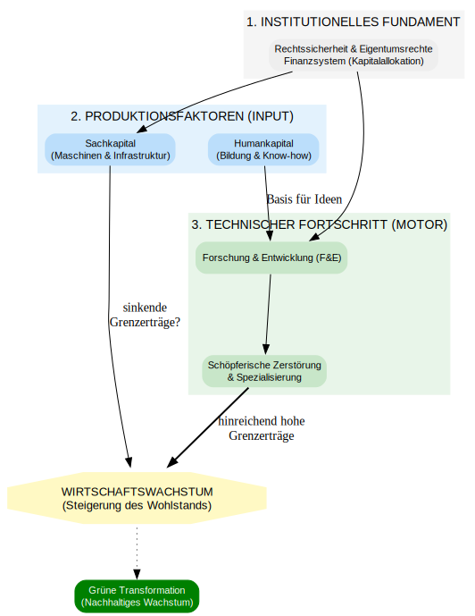

# Einleitung

## Themen

-   Wirtschaftswachstum ist ein regelmäßig auftretendes empirisches Phänomen **aber nicht selbstverständlich**

-   Historisch ist die Erfahrung von Wirtschaftswachstum relativ neu $\rightarrow$ Warum wachsen Volkswirtschaften?

-   Warum wachsen einige Volkswirtschaften stärker als andere?

-   Wodurch entsteht Wirtschaftswachstum? (Spoiler: Das ist gar nicht so leicht zu erklären)

-   Lässt sich beeinflussen, ob und wie Wirtschaften wachsen?

-   Ist „grünes“ Wachstum möglich? Ist Wachstumsverzicht eine Strategie für eine nachhaltige Entwicklung und Klimaschutz?

-   $\dots$

## Ein Blick in die Daten

```{r}
#| message: false
#| warning: false

# Daten von OWiD laden

library(tidyverse)

df <- read.csv('https://ourworldindata.org/grapher/gdp-per-capita-worldbank.csv?v=1&csvType=full&useColumnShortNames=true')

#head(df)

# Daten filtern

df <- df %>%
  filter(!grepl("Europe|countries|WB", entity),
         entity != "World")

#unique(df$Entity)

# Grafik erzeugen 

p <- df %>% group_by(entity)%>%
       filter(year >= 1990,
             any(year==1990)) %>%
       mutate(index=ny_gdp_pcap_pp_kd/ny_gdp_pcap_pp_kd[year==1990]*100)%>%
       ggplot(aes(year, index ))+
       geom_line(aes(color=entity), alpha=.3)+
       geom_quantile()+
       scale_y_log10()+
       theme_light()+
       theme(legend.position="none")+
       labs(title= 'BIP pro Kopf, Index 1990=100',
            subtitle= 'KKP, 2021 international $',
            x= 'Jahr',
            y= 'Index',
            color= 'entity',
            caption= paste('Darstellung: Jan S. Voßwinkel,  Daten: Ourworldindata.org'))

# Grafik ausgeben

p

```

```{r}
#| message: false
#| warning: false

# Interaktiver Output


library(canvasXpress)


# Grafik erzeugen 
p1 <- canvasXpress(p)

# Output 

p1


```

## (Warum) ist Wirtschaftswachstum wichtig?

```{python}
#| message: false
#| warning: false
#| output: false

import graphviz
from IPython.display import display

# Erstellung des Digraph-Objekts
dot = graphviz.Digraph(comment='Wirtschaftswachstum Logik', format='png')

# Globale Attribute für ein sauberes Design
dot.attr(rankdir='TB', size='10,10', fontname='Arial')
dot.attr('node', shape='rectangle', style='filled, rounded', color='lightblue', fontname='Arial')

# Zentrale Definition
dot.node('W', 'Wirtschaftswachstum\n(Anstieg des BIP)', fillcolor='#D1E8FF')

# Indikatoren & Basis
dot.node('BIP_Kopf', 'BIP pro Kopf\n(Maßstab Lebensstandard)', fillcolor='#E1F5FE')
dot.edge('W', 'BIP_Kopf')

# Cluster 1: Materieller Wohlstand & Soziales
with dot.subgraph(name='cluster_0') as c:
    c.attr(label='Materieller Wohlstand & Stabilität', style='dotted')
    c.node('Armut', 'Armutsreduzierung')
    c.node('Gesundheit', 'Gesundheit & Lebenserwartung')
    c.node('Sozialstaat', 'Finanzierung Sozialstaat\n(Rente, Bildung, Infrastruktur)')
    c.node('Arbeit', 'Arbeitsplätze & Einkommen')

dot.edge('BIP_Kopf', 'Armut')
dot.edge('BIP_Kopf', 'Gesundheit')
dot.edge('W', 'Arbeit')
dot.edge('W', 'Sozialstaat')

# Cluster 2: Innovation & Fortschritt
with dot.subgraph(name='cluster_1') as c:
    c.attr(label='Innovation', style='dotted')
    c.node('Invest', 'Investitionsanreize\n& Renditeerwartung')
    c.node('FE', 'Forschung & Entwicklung')
    c.node('Prod', 'Produktivitätssteigerung')

dot.edge('W', 'Invest')
dot.edge('Invest', 'FE')
dot.edge('FE', 'Prod')
dot.edge('Prod', 'BIP_Kopf', label='langfristig')

# Cluster 3: Ökologie & Kritik
with dot.subgraph(name='cluster_2') as c:
    c.attr(label='Ökologische Transformation', style='dotted')
    c.node('Klima', 'Klimaneutraler Umbau\n(Hoher Kapitalbedarf)')
    c.node('Entkoppel', 'Entkoppelung vom\nRessourcenverbrauch')
    c.node('Kritik', 'Wachstumskritik\n(Ökologische Grenzen)', fillcolor='#FFCDD2')

dot.edge('W', 'Klima', label='finanzielle Basis')
dot.edge('Klima', 'Entkoppel', style='dashed')
dot.edge('W', 'Kritik', dir='both', color='red', label='Spannungsfeld')

# Anzeige des Graphen
#display(dot)


# Speichern des Graphen als SVG-Datei
dot.render('Ueberblick', format='svg', cleanup=True)

```


::: {.callout-important icon="false" collapse="true"}
# Der Text zum Bild {.unnumbered}

Wirtschaftswachstum wird üblicherweise als die langfristige jährliche Steigerungsrate des Bruttoinlandsprodukts eines Landes definiert [@aghion_economics_2008]. Es beschreibt einen Prozess, bei dem eine Volkswirtschaft im Zeitverlauf mehr Güter sowie eine höhere Qualität der Gütern hervorbringt [@braun_warum_2025]. Ein zentraler Indikator ist dabei das Bruttoinlandsprodukt pro Kopf, das die Wirtschaftsleistung ins Verhältnis zur Bevölkerungszahl setzt und als Maßstab für den durchschnittlichen Lebensstandard dient [@braun_warum_2025].

Die Relevanz dieses Wachstums ergibt sich primär daraus, dass es maßgeblich das materielle Wohlergehen von Milliarden von Menschen bestimmt. Historisch gesehen ermöglichte erst das mit der industriellen Revolution einsetzende Wachstum einen massiven Anstieg von Einkommen, Gesundheit und Lebenserwartung. In Ländern wie Indien hat ein beschleunigtes Wachstum beispielsweise zu einer erheblichen Reduzierung der Armut geführt [@aghion_economics_2008; @braun_warum_2025].

Darüber hinaus fungiert Wachstum in modernen Gesellschaften als ein entscheidender Stabilitätsfaktor. Es schafft die notwendigen Anreize für Unternehmen zu investieren, wodurch neue Arbeitsplätze entstehen und die Einkommen der Bevölkerung steigen können. Ebenso bildet die wirtschaftliche Expansion die fiskalische Grundlage für die Finanzierung des Sozialstaats. Durch steigende Steuereinnahmen und Sozialbeiträge können staatliche Aufgaben in den Bereichen Rente, Gesundheit, Bildung und Infrastruktur gewährleistet werden. Ein Ausbleiben von Wachstum verschärft hingegen gesellschaftliche Verteilungskonflikte und gefährdet stabile politische Verhältnisse [@braun_warum_2025].

Wachstum ist zudem ein wesentlicher Motor für Innovation und technischen Fortschritt. In einer expandierenden Wirtschaft haben Unternehmen höhere Renditeerwartungen, was riskante Investitionen in Forschung und Entwicklung rechtfertigt. Dieser technologische Fortschritt ist wiederum die Voraussetzung für langfristige Produktivitätssteigerungen, die den Lebensstandard weiter erhöhen können [@braun_warum_2025].

In der aktuellen Debatte wird Wachstum zudem als notwendige Bedingung für die ökologische Transformation angesehen. Der Umbau zu einer klimaneutralen Wirtschaft erfordert Investitionen in einem bislang unbekannten Ausmaß, die ohne eine starke ökonomische Basis kaum zu bewältigen wären. Technologische Innovationen können dabei helfen, das Wirtschaftswachstum vom Ressourcenverbrauch zu entkoppeln [@braun_warum_2025].

Trotz dieser Funktionen steht das Wachstumsparadigma heute aufgrund ökologischer Grenzen und der Endlichkeit natürlicher Ressourcen verstärkt in der Kritik. Kritische Stimmen fordern daher teilweise eine Abkehr vom stetigen Wachstum oder sogar ein Schrumpfen der Wirtschaftsleistung, um die Umweltbelastung zu reduzieren [@herrmann_wir_2025; @plumpe_wachstum_2025].

Dennoch bleibt nach Ansicht von Befürwortern das Streben nach Fortschritt und Verbesserung eine starke menschliche Triebkraft, die für die Bewältigung zukünftiger Aufgaben zentral bleibt [@braun_warum_2025].
:::

## Wie entsteht Wachstum?

```{python}
#| message: false
#| warning: false
#| output: false

import graphviz
from IPython.display import display

# Erstellung des Graphen (Top-Down)
dot = graphviz.Digraph(comment='Strukturmodell Wirtschaftswachstum', format='png')

# Design-Vorgaben für maximale Klarheit
dot.attr(rankdir='TB', nodesep='0.5', ranksep='0.8', fontname='Arial')
dot.attr('node', shape='box', style='filled, rounded', color='none', fontname='Arial', fontsize='11')

# 1. Das Fundament (Institutionen)
with dot.subgraph(name='cluster_foundation') as c:
    c.attr(label='1. INSTITUTIONELLES FUNDAMENT', style='filled', color='#F5F5F5')
    c.node('INST', 'Rechtssicherheit & Eigentumsrechte\nFinanzsystem (Kapitalallokation)', fillcolor='#EEEEEE')

# 2. Die Säulen (Produktionsfaktoren)
with dot.subgraph(name='cluster_factors') as c:
    c.attr(label='2. PRODUKTIONSFAKTOREN (INPUT)', style='filled', color='#E3F2FD')
    c.node('K', 'Sachkapital\n(Maschinen & Infrastruktur)', fillcolor='#BBDEFB')
    c.node('H', 'Humankapital\n(Bildung & Know-how)', fillcolor='#BBDEFB')

# 3. Der Motor (Innovation)
with dot.subgraph(name='cluster_engine') as c:
    c.attr(label='3. TECHNISCHER FORTSCHRITT (MOTOR)', style='filled', color='#E8F5E9')
    c.node('RD', 'Forschung & Entwicklung (F&E)', fillcolor='#C8E6C9')
    c.node('INNO', 'Schöpferische Zerstörung\n& Spezialisierung', fillcolor='#C8E6C9')

# 4. Das Ergebnis
dot.node('OUT', 'WIRTSCHAFTSWACHSTUM\n(Steigerung des Wohlstands)',
         shape='doubleoctagon', fillcolor='#FFF9C4', style='filled, bold', fontsize='13')

# Logische Verbindungen
dot.edge('INST', 'K')
dot.edge('INST', 'RD')
dot.edge('K', 'OUT', label='sinkende\n Grenzerträge?')
dot.edge('H', 'RD', label='Basis für Ideen')
dot.edge('RD', 'INNO')
dot.edge('INNO', 'OUT', label='hinreichend hohe\n Grenzerträge', penwidth='2.0')

# Spezial-Knoten für die Zukunft
dot.node('GREEN', 'Grüne Transformation\n(Nachhaltiges Wachstum)', color='green', fontcolor='white')
dot.edge('OUT', 'GREEN', style='dotted')

#display(dot)

# Speichern des Graphen als SVG-Datei
dot.render('Ursachen', format='svg', cleanup=True)
```



::: {.callout-important icon="false" collapse="true"}
# Der Text zum Bild {.unnumbered}

Wirtschaftswachstum wird üblichwerweise als die langfristige durchschnittliche jährliche Steigerungsrate des Bruttoinlandsprodukts eines Landes definiert [@aghion_economics_2008].

Ein grundlegender Erklärungsansatz ist das neoklassische Wachstumsmodell nach Solow und Swan, das die Akkumulation von Sachkapital und Arbeit als zentrale Triebkräfte ansieh. In diesem Modell führen abnehmende Grenzerträge des Kapitals dazu, dass allein durch Investitionen kein dauerhaftes Pro-Kopf-Wachstum erzielt werden kann, weshalb langfristiges Wachstum in diesem Rahmen durch exogenen technischen Fortschritt erklärt werden muss [@aghion_economics_2008].

Im Gegensatz dazu gehen endogene Wachstumstheorien davon aus, dass der technologische Fortschritt das Ergebnis ökonomischer Entscheidungen innerhalb des Systems ist. Das sogenannte AK-Modell bildet hierbei eine einfache Form, bei der Investitionen in physisches, menschliches und intellektuelles Kapital zusammengefasst werden und keine abnehmenden Grenzerträge aufweisen, sodass eine höhere Ersparnis zu dauerhaft höheren Wachstumsraten führt [@aghion_economics_2008].

Ein weiterer Zweig endogener Modelle betont die Produktheterogenität, wobei Wachstum durch eine stetige Ausweitung der Vielfalt an Zwischenprodukten entsteht. Diese Modelle basieren auf der Idee, dass Forschungs- und Entwicklungsaktivitäten durch Monopolrenten für neue Entwürfe motiviert werden [@aghion_economics_2008].

Die schumpeterianische Wachstumstheorie erklärt Fortschritt hingegen durch qualitätsverbessernde Innovationen, die bestehende Produkte verdrängen und somit einen Prozess der schöpferischen Zerstörung auslösen [@aghion_economics_2008].

Neben Kapital und Innovation spielen Institutionen eine entscheidende Rolle, wobei historische Faktoren wie rechtliche Ursprünge oder koloniale Hintergründe die langfristige wirtschaftliche Leistungsfähigkeit prägen [@aghion_economics_2008]. Die Wirksamkeit bestimmter Institutionen hängt dabei oft von der Nähe einer Volkswirtschaft zur globalen technologischen Grenze ab, wobei länderferne Staaten eher von Imitation und erfahrungsbasierten Strukturen profitieren, während Staaten an der technologischen Grenze auf innovationsfördernde Maßnahmen angewiesen sind [@aghion_economics_2008].

Auch Bildungsinvestitionen wirken sich differenziert aus, da eine breite Primärbildung den technologischen Anschluss erleichtert, während tertiäre Bildung vor allem die Innovationsfähigkeit an der technologischen Grenze stärkt [@aghion_economics_2008]. Historisch gesehen gelang der Ausbruch aus der malthusianischen Stagnation, in der die Landknappheit den Lebensstandard begrenzte, erst durch die Industrialisierung und den damit verbundenen Wissenszuwachs [@aghion_economics_2008]. Schließlich unterstützen gut funktionierende Finanzsysteme das Wachstum, indem sie Kapital effizient an erfolgversprechende Projekte vermitteln und Agenturprobleme durch Überwachung reduzieren [@aghion_economics_2008; @novales_economic_2022].
:::
