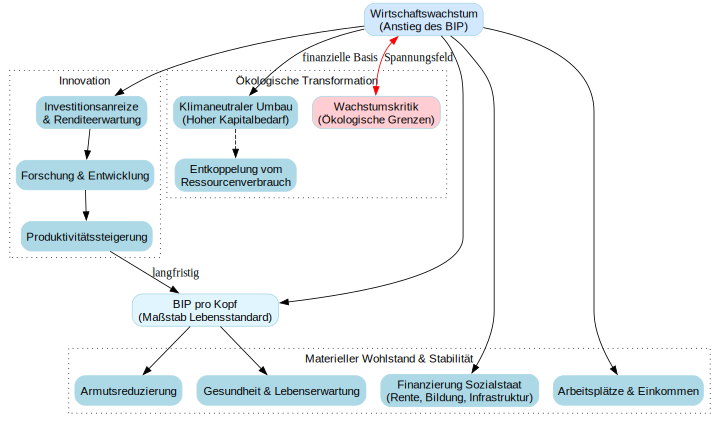

# Einleitung

## Themen

- Wirtschaftswachstum ist ein regelmäßig auftretendes empirisches Phänomen **aber nicht selbstverständlich**

- Historisch ist die Erfahrung von Wirtschaftswachstum relativ neu $\rightarrow$ Warum wachsen Volkswirtschaften?

- Warum wachsen einige Volkswirtschaften stärker als andere?

- Wodurch entsteht Wirtschaftswachstum? (Spoiler: Das ist gar nicht so leicht zu erklären)

- Lässt sich beeinflussen, ob und wie Wirtschaften wachsen?

- Ist &bdquo;grünes&ldquo; Wachstum möglich? Ist Wachstumsverzicht eine Strategie für eine nachhaltige Entwicklung und Klimaschutz?

- $\dots$

## Ein Blick in die Daten

```{r}
#| message: false
#| warning: false

# Daten von OWiD laden

library(tidyverse)

df <- read.csv('https://ourworldindata.org/grapher/gdp-per-capita-worldbank.csv?v=1&csvType=full&useColumnShortNames=true')

#head(df)

# Daten filtern

df <- df %>%
  filter(!grepl("Europe|countries|WB", entity),
         entity != "World")

#unique(df$Entity)

# Grafik erzeugen 

p <- df %>% group_by(entity)%>%
       filter(year >= 1990,
             any(year==1990)) %>%
       mutate(index=ny_gdp_pcap_pp_kd/ny_gdp_pcap_pp_kd[year==1990]*100)%>%
       ggplot(aes(year, index ))+
       geom_line(aes(color=entity), alpha=.3)+
       geom_quantile()+
       scale_y_log10()+
       theme_light()+
       theme(legend.position="none")+
       labs(title= 'BIP pro Kopf, Index 1990=100',
            subtitle= 'KKP, 2021 international $',
            x= 'Jahr',
            y= 'Index',
            color= 'entity',
            caption= paste('Darstellung: Jan S. Voßwinkel,  Daten: Ourworldindata.org'))

# Grafik ausgeben

p

```

```{r}
#| message: false
#| warning: false

# Interaktiver Output


library(canvasXpress)


# Grafik erzeugen 
p1 <- canvasXpress(p)

# Output 

p1


```

## (Warum) ist Wirtschaftswachstum wichtig?

```{python}
#| message: false
#| warning: false
#| output: false

import graphviz
from IPython.display import display

# Erstellung des Digraph-Objekts
dot = graphviz.Digraph(comment='Wirtschaftswachstum Logik', format='png')

# Globale Attribute für ein sauberes Design
dot.attr(rankdir='TB', size='10,10', fontname='Arial')
dot.attr('node', shape='rectangle', style='filled, rounded', color='lightblue', fontname='Arial')

# Zentrale Definition
dot.node('W', 'Wirtschaftswachstum\n(Anstieg des BIP)', fillcolor='#D1E8FF')

# Indikatoren & Basis
dot.node('BIP_Kopf', 'BIP pro Kopf\n(Maßstab Lebensstandard)', fillcolor='#E1F5FE')
dot.edge('W', 'BIP_Kopf')

# Cluster 1: Materieller Wohlstand & Soziales
with dot.subgraph(name='cluster_0') as c:
    c.attr(label='Materieller Wohlstand & Stabilität', style='dotted')
    c.node('Armut', 'Armutsreduzierung')
    c.node('Gesundheit', 'Gesundheit & Lebenserwartung')
    c.node('Sozialstaat', 'Finanzierung Sozialstaat\n(Rente, Bildung, Infrastruktur)')
    c.node('Arbeit', 'Arbeitsplätze & Einkommen')

dot.edge('BIP_Kopf', 'Armut')
dot.edge('BIP_Kopf', 'Gesundheit')
dot.edge('W', 'Arbeit')
dot.edge('W', 'Sozialstaat')

# Cluster 2: Innovation & Fortschritt
with dot.subgraph(name='cluster_1') as c:
    c.attr(label='Innovation', style='dotted')
    c.node('Invest', 'Investitionsanreize\n& Renditeerwartung')
    c.node('FE', 'Forschung & Entwicklung')
    c.node('Prod', 'Produktivitätssteigerung')

dot.edge('W', 'Invest')
dot.edge('Invest', 'FE')
dot.edge('FE', 'Prod')
dot.edge('Prod', 'BIP_Kopf', label='langfristig')

# Cluster 3: Ökologie & Kritik
with dot.subgraph(name='cluster_2') as c:
    c.attr(label='Ökologische Transformation', style='dotted')
    c.node('Klima', 'Klimaneutraler Umbau\n(Hoher Kapitalbedarf)')
    c.node('Entkoppel', 'Entkoppelung vom\nRessourcenverbrauch')
    c.node('Kritik', 'Wachstumskritik\n(Ökologische Grenzen)', fillcolor='#FFCDD2')

dot.edge('W', 'Klima', label='finanzielle Basis')
dot.edge('Klima', 'Entkoppel', style='dashed')
dot.edge('W', 'Kritik', dir='both', color='red', label='Spannungsfeld')

# Anzeige des Graphen
#display(dot)


# Speichern des Graphen als SVG-Datei
dot.render('Ueberblick', format='svg', cleanup=True)

```

